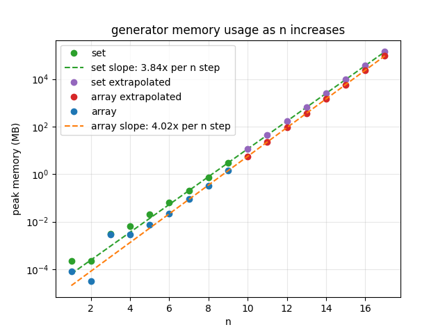
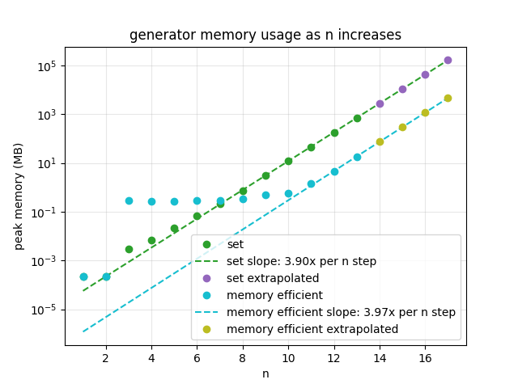

Previously I addressed an issue in my generator algorithm where the time latency was scaling at an uncontrollable rate (see "1 - Array Generation Latency.md"). My solution to this was using hash sets which allowed me to progress to greater polyomino generation sizes however as I have gotten to large values of n I am noticing spikes in my memory usage so I decided to investigate.

I decided to redesign my analysis/time_scalability_analysis.py script to instead monitor memory usage. This allowed me to visualise exactly how memory scaled with higher polyomino factors (n). This script is analysis/memory_scalability_analysis.py:



| n | array memory (MB) | set memory (MB) | source |
|--:|------------------:|----------------:|--------|
| 1 | 8.000e-05 | 2.240e-04 | measured |
| 2 | 3.200e-05 | 2.240e-04 | measured |
| 3 | 2.936e-03 | 3.048e-03 | measured |
| 4 | 2.968e-03 | 6.704e-03 | measured |
| 5 | 7.632e-03 | 2.109e-02 | measured |
| 6 | 2.127e-02 | 6.558e-02 | measured |
| 7 | 8.847e-02 | 2.090e-01 | measured |
| 8 | 3.340e-01 | 7.463e-01 | measured |
| 9 | 1.428e+00 | 3.077e+00 | measured |
| 10 | 5.619e+00 | 1.153e+01 | predicted |
| 11 | 2.258e+01 | 4.423e+01 | predicted |
| 12 | 9.070e+01 | 1.697e+02 | predicted |
| 13 | 3.644e+02 | 6.512e+02 | predicted |
| 14 | 1.464e+03 | 2.498e+03 | predicted |
| 15 | 5.882e+03 | 9.587e+03 | predicted |
| 16 | 2.363e+04 | 3.678e+04 | predicted |
| 17 | 9.494e+04 | 1.411e+05 | predicted |

This shows that as n scales the memory usage becomes unsustainable. To address this issue I first needed to find the source of this scaling issue. 

Almost everything the generator uses is thrown away in each iteration so the culprit of the memory scaling issue had to be structures which continually grew as n got bigger and were stored in memory throughout the whole runtime. These ended up being the growing "shapes" list and "seen" set which grow with each nth generation, which store every new shape twice (both as its set of coordinates and in its standard form):

```python
def try_add_shape(new_shape, shapes, n, seen):
    if check_redundance(new_shape, seen, n) == False:
        new_shape = format_polyomino(new_shape)
        seen.add(standard_form(new_shape))
        shapes.append(new_shape)
```

Additionally, the previous_shapes list stored the shape results for every n-1th generation, further clogging up memory:

```python
previous_shapes = returnShapes(n-1)

with open(f"results/sets/polyominoes_{n-1}.json") as file:
    previous_shapes = []
    for shape in json.load(file):
        loaded_shape = set()
        for cell in shape:
            loaded_shape.add((cell[0], cell[1]))
        previous_shapes.append(loaded_shape)
```

The easiest of these to fix was the storing of previous_shapes as previously the whole list of values was loaded all at once. Since building off previous shapes only needs to happen iteratively one shape at a time only one shape has to be loaded. Fixing this simply meant transferring to json lines (jsonl) instead of json which allowed the file to be read one line at a time. This makes the memory usage of previous_shapes constant.

| n | set (MB) | set with jsonl read fix (MB) |
|--:|---------:|------------------------:|
| 1 | 2.240e-04 | 2.240e-04 |
| 2 | 2.240e-04 | 2.240e-04 |
| 3 | 3.560e-03 | 2.693e-01 |
| 4 | 7.024e-03 | 1.463e-01 |
| 5 | 2.126e-02 | 1.573e-01 |
| 6 | 6.558e-02 | 1.928e-01 |
| 7 | 2.090e-01 | 3.120e-01 |
| 8 | 7.463e-01 | 7.711e-01 |
| 9 | 3.077e+00 | 2.733e+00 |
| 10 | 1.178e+01 | 1.014e+01 |
| 11 | 4.604e+01 | 3.949e+01 |
| 12 | 1.808e+02 | 1.558e+02 |
| 13 | 7.138e+02 | — |

Interestingly the jsonl implementation is more memory intensive for n values smaller than 9, likely due to python's memory overhead for reading files. However, at n >= 9 line by line reads reduce memory usage by 11-14%. It's also notable that the memory saving is a fixed fraction rather than a change in scaling factor as it addresses how shapes are stored rather than how the number of shapes grows.

Next we can use jsonl to completely remove the need for the shapes list by writing each new shape to a file rather than storing it in memory. This transfers the overhead to storage instead of memory, increasing the program's load bearing capacity. This can be done because the shapes list is never read, just used to store new shapes. Instead the seen set is what is used to check for duplicates.

Implementing this change further reduces memory overhead:

| n | set with jsonl read fix (MB) | set with jsonl read + write fix (MB) |
|--:|-----------------------------:|-------------------------------------:|
| 1 | 2.240e-04 | 2.240e-04 |
| 2 | 2.240e-04 | 2.240e-04 |
| 3 | 2.693e-01 | 2.953e-01 |
| 4 | 1.463e-01 | 2.769e-01 |
| 5 | 1.573e-01 | 2.790e-01 |
| 6 | 1.928e-01 | 2.929e-01 |
| 7 | 3.120e-01 | 3.405e-01 |
| 8 | 7.711e-01 | 5.042e-01 |
| 9 | 2.733e+00 | 1.186e+00 |
| 10 | 1.014e+01 | 3.867e+00 |
| 11 | 3.949e+01 | 1.503e+01 |
| 12 | 1.558e+02 | 6.026e+01 |

This results in up to 62% more memory being saved for n >= 10, with the estimated memory usage for n=17 being around 60GB, assuming a scaling factor of 4x (still unfeasible for most setups).

This leaves reducing the memory overhead of the "seen" set. Here we cannot follow the other fixes in deferring the memory usage to storage as the seen set needs to be checked repeatedly for duplicates and putting it in storage would severely increase latency. Instead what we can do is simplify how the standard forms of shapes are stored. Currently they are stored as tuples of coordinates, however we can convert each shape into a single number using hashing.

Hashing would take in the inputted tuples and use them to build a scrambled number. This could not be used to recreate the shape but would work for checking shape duplicates as passing two equal shapes into the hash function would produce the same hash since it is deterministic. Python hashing is 64 bit so the chance of two individual shapes having the same hash is 1 in 2^64, for n=17 we are expecting 50107909 unique shapes (see polyominos_series in generators/array_generator.py) meaning the probability that two shapes overlap at n=17 is 1/2^64 times the number of possible pairs.

This gives:

$$\frac{1}{2^{64}} \times \frac{50107909 \times (50107909 - 1)}{2} = 0.0000681$$

This is a 0.00681% chance or 1 in 14,700 and so can be considered negligible.

| n | set with jsonl read + write fix (MB) | set with jsonl read + write + hash fix (MB) |
|--:|-------------------------------------:|--------------------------------------------:|
| 1 | 2.240e-04 | 2.240e-04 |
| 2 | 2.240e-04 | 2.240e-04 |
| 3 | 2.953e-01 | 2.951e-01 |
| 4 | 2.769e-01 | 2.758e-01 |
| 5 | 2.790e-01 | 2.763e-01 |
| 6 | 2.929e-01 | 2.814e-01 |
| 7 | 3.405e-01 | 2.982e-01 |
| 8 | 5.042e-01 | 3.355e-01 |
| 9 | 1.186e+00 | 4.849e-01 |
| 10 | 3.867e+00 | 5.888e-01 |
| 11 | 1.503e+01 | 1.423e+00 |
| 12 | 6.026e+01 | 4.649e+00 |
| 13 | — | 1.845e+01 |



This saves up to 90% of memory at high values of n. Extrapolating for n=17 at a 4x scaling factor predicts memory usage to be just under 5GB.

Together all these fixes reduce memory usage by over 97%, turning n=17 generation from a predicted 141GB into under 5GB. The 4x scaling factor is unchanged, but the wall has been pushed past the largest n the grid can hold.

All these optimisations were made on generators/memory_efficient_generator.py