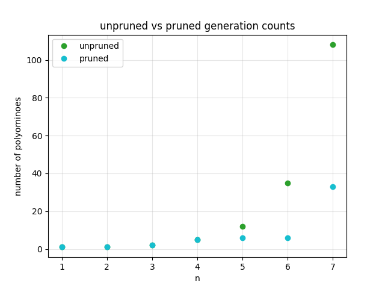
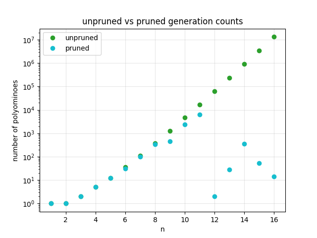

# Problem Specific Pruning

## The Restriction Idea

Currently `generators/set_generator.py` generates every possible nth polyomino even though it is not possible for every polyomino to appear in a puzzle grid. By adding restrictions for what can appear in a grid, certain polyominos can be filtered out. Early filtering provides exponential gains at each subsequent value of n since a key rule of this puzzle is that any n+1th polyomino must be an extension of the nth polyomino.

Unpruned generation counts:

| n | 1 | 2 | 3 | 4 | 5 | 6 | 7 | 8 | 9 | 10 | 11 | 12 | 13 | 14 | 15 | 16 | 17 |
|---|--:|--:|--:|--:|--:|--:|--:|--:|--:|---:|---:|---:|---:|---:|---:|---:|---:|
| shapes | 1 | 1 | 2 | 5 | 12 | 35 | 108 | 369 | 1285 | 4655 | 17073 | 63600 | 238591 | 901971 | 3426576 | 13079255 | 50107909 |

## A Worked Example

Each puzzle already contains some restrictions for how the polyominos must fit by including squares that need to contain specific numbers. Below is a test case where you can see this visually:

```python
test8 = [
            [3, 0, 0, 2, 0, 0],
            [0, 4, 0, 0, 0, 0],
            [0, 0, 0, 0, 7, 0],
            [0, 0, 0, 7, 0, 5],
            [0, 1, 6, 0, 7, 0],
            [0, 0, 0, 0, 0, 6]
        ]
```

In the example there are certain restrictions when looking at 6 and 7. For the 7th polyomino there must be 3 sevens zigzagging like so:
```python
[
    [0, 7],
    [7, 0],
    [0, 7]
]
```

And for the 6th polyomino there is a fixed arrangement between two 6s with a restriction in the form of the interfering 7:
```python
[
    [6, 0, 7, 0],
    [0, 0, 0, 6],
]
```

Since all other numbers are blockers for clarity we can just replace them and all other blockers with Xs:

```python
[
    ["x", "x", "x", "x", "x", "x", "x", "x"],
    ["x", "x",  0 ,  0 , "x",  0 ,  0 , "x"],
    ["x",  0 ,  0 ,  0 ,  0 ,  0 ,  0 , "x"],
    ["x",  0 ,  0 ,  0 ,  0 , "x",  0 , "x"],
    ["x",  0 ,  0 ,  0 , "x",  0 , "x", "x"],
    ["x",  0 , "x",  6 ,  0 , "x",  0 , "x"],
    ["x",  0 ,  0 ,  0 ,  0 ,  0 ,  6 , "x"],
    ["x", "x", "x", "x", "x", "x", "x", "x"],
]
```

With these blockers there are only 6 possible arrangements:
```python
arrangement_1 = [
                    [6, 6, "x", 0],
                    [6, 6,  6 , 6],
                ]
arrangement_2 = [
                    [6, 0, "x", 6],
                    [6, 6,  6 , 6],
                ]
arrangement_3 = [
                    [6, 6, "x", 6],
                    [0, 6,  6 , 6],
                ]
arrangement_4 = [
                    [6, "x", 0, "x"],
                    [6,  6 , "x", 0],
                    [0,  6 ,  6 , 6],
                ]
arrangement_5 = [
                    [6, "x", 0, "x"],
                    [6,  0 , "x", 0],
                    [6,  6 ,  6 , 6],
                ]
arrangement_6 = [
                    ["x", 6, 0, "x", 0],
                    [ 6 , 6, 6,  6 , 6],
                ]
```

This is significantly less than the 35 that would have been generated using the regular generator.

## Whole-Board Patterns

In practice we can display the whole board in a text file inside the `boards` folder showing the whole visible board and using it to set restrictions:

`boards/test_board_8.txt` for our test case:
```
3 0 0 2 0 0
0 4 0 0 0 0
0 0 0 0 7 0
0 0 0 7 0 5
0 1 6 0 7 0
0 0 0 0 0 6
```

The board once converted into a 2D list for n=6 using `make_pattern()`:
```python
#make_pattern(board, 6)
[
    ["X", "X", "X", "X", "X", "X", "X", "X"],
    ["X", "X", "0", "0", "X", "0", "0", "X"],
    ["X", "0", "X", "0", "0", "0", "0", "X"],
    ["X", "0", "0", "0", "0", "X", "0", "X"],
    ["X", "0", "0", "0", "X", "0", "X", "X"],
    ["X", "0", "X", "6", "0", "X", "0", "X"],
    ["X", "0", "0", "0", "0", "0", "6", "X"],
    ["X", "X", "X", "X", "X", "X", "X", "X"],
]
```

(Each n gets its own pattern) for n=7 the 7s would stay while all the other numbers would become Xs.

Each generated shape is then tested in every orientation, rotation and position using the pattern. Shapes only count as valid if there is some area of the grid where they have a valid placement (shape fits over all numbers without colliding with an X).

This filtering happens during generation rather than after it. Each generation is filtered before it gets extended, meaning a pruned shape never creates any children. This provides exponential gains as new generations only build off valid previous ones.

All of this early pruning was implemented in `generators/selective_pruning.py` with results stored in `results/early_pruning` in a subfolder based on the board pruning was done using.

## Results

Inputting the `test8` board produced the following numbers of polyominos:



| n | 1 | 2 | 3 | 4 | 5 | 6 | 7 |
|---|--:|--:|--:|--:|--:|--:|--:|
| unpruned | 1 | 1 | 2 | 5 | 12 | 35 | 108 |
| pruned | 1 | 1 | 2 | 5 | 6 | 6 | 33 |

Individual numbers on the board are barely pruned as seen for n<=4, since a single clue in open space is barely restrictive.

Applying this now for the real puzzle using the board in `boards/subtiles_2.txt`:



| n | 1 | 2 | 3 | 4 | 5 | 6 | 7 | 8 | 9 | 10 | 11 | 12 | 13 | 14 | 15 | 16 |
|---|--:|--:|--:|--:|--:|--:|--:|--:|--:|---:|---:|---:|---:|---:|---:|---:|
| unpruned | 1 | 1 | 2 | 5 | 12 | 35 | 108 | 369 | 1285 | 4655 | 17073 | 63600 | 238591 | 901971 | 3426576 | 13079255 |
| pruned | 1 | 1 | 2 | 5 | 12 | 31 | 101 | 344 | 451 | 2434 | 6296 | 2 | 28 | 358 | 54 | 14 |

In total only 10,134 shapes were generated instead of 17,733,539 (1750x fewer). The biggest prune is at n=12, where the four spread out 12s are very restrictive, leaving only 2 possible shapes. Every generation after that is built off those 2 shapes, showing how early pruning can heavily cut down the rest of the chain.

This leaves a small list for every high values of n (only 14 shapes at n=16), which makes solving the full grid much easier computationally.
