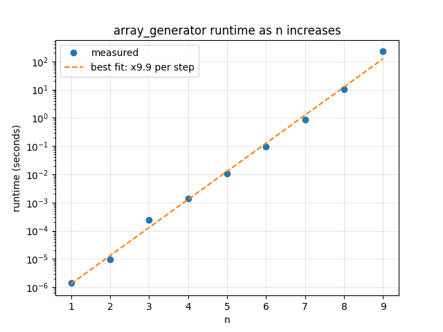
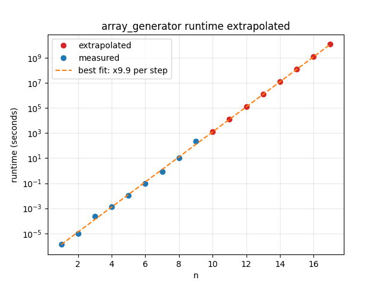
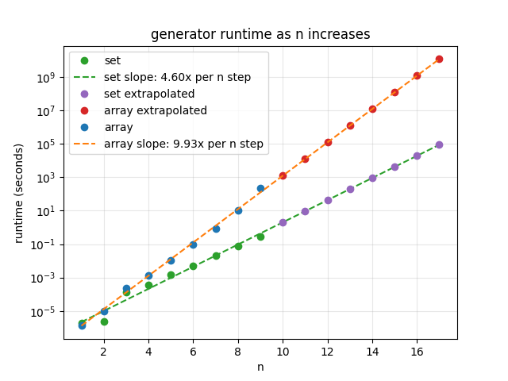

I created a python file (run_evaluator.py) which computed runtimes for each factor n for my generator.py (now array_generator.py):

| n | runtime (seconds) |
|--:|------------------:|
| 1 | 1.431e-06 |
| 2 | 9.537e-06 |
| 3 | 2.403e-04 |
| 4 | 1.391e-03 |
| 5 | 1.042e-02 |
| 6 | 9.278e-02 |
| 7 | 8.523e-01 |
| 8 | 1.028e+01 |
| 9 | 2.246e+02 |

Extrapolating for all values of n up to 17 (the maximum possible for my grid arrangement) I produced the following graph using scalability_analysis.py:

This gives the following values:

| n | runtime (seconds) | source |
|--:|------------------:|--------|
| 1 | 1.431e-06 | measured |
| 2 | 9.537e-06 | measured |
| 3 | 2.403e-04 | measured |
| 4 | 1.391e-03 | measured |
| 5 | 1.042e-02 | measured |
| 6 | 9.278e-02 | measured |
| 7 | 8.523e-01 | measured |
| 8 | 1.028e+01 | measured |
| 9 | 2.246e+02 | measured |
| 10 | 1.225e+03 | predicted |
| 11 | 1.215e+04 | predicted |
| 12 | 1.206e+05 | predicted |
| 13 | 1.197e+06 | predicted |
| 14 | 1.188e+07 | predicted |
| 15 | 1.180e+08 | predicted |
| 16 | 1.171e+09 | predicted |
| 17 | 1.162e+10 | predicted |

This would mean running the generator for n=17 would take over 300 years so I developed a per function analysis flag in run_evaluator.py which showed me what percentage of runtime was occupied by each of the top 10 longest running functions:

| Rank | Function | Occupancy |
|-----:|----------|----------:|
| 1 | `get_right_corner` | 28.56% |
| 2 | `get_left_corner` | 22.97% |
| 3 | `<built-in method builtins.len>` | 14.71% |
| 4 | `rotate_90` | 8.54% |
| 5 | `check_equality` | 7.91% |
| 6 | `mirror` | 7.32% |
| 7 | `check_redundance` | 3.94% |
| 8 | `<built-in method builtins.exec>` | 2.53% |
| 9 | `format_polyomino` | 1.87% |
| 10 | `extend_shape` | 1.64% |

Six of these functions are called by the check_redundance() function [get_right_corner, get_left_corner, rotate_90, check_equality, mirror and most len() calls], meaning that around 90% of the top 10 functions' runtime is dedicated to functions called by the redundancy checker. Optimising this process should therefore be prioritised. Fixing this would mean that n scaling would line up more closely with the polyomino scaling factor (around 3.6).

Using a hash set would allow for O(1) lookups as long as all polyominos are converted to a standard form first. That's why I decided to rethink how I standardised polyomino representation. This is the new approach I decided on:
1. After generation each polyomino is translated so its top left corner fits to 0,0 (standardising position)
2. All of its mirrors and rotations are generated
3. These are then passed through a sort() and the first option is chosen as the standard form (for the same canonical shapes the same 8 mirrors/rotations are always generated so sorting always provides the same values)
4. This standard form is then added to the hash set
5. When a new shape is generated it goes through this process and is checked against the hash set to check for uniqueness

Applying all of this in set_generator.py lowered the scaling factor from 9.93 to 4.60 and allowed for generation up to n=17 to only take 1 day (a 130,000x speed increase):

| n | runtime (seconds) | source |
|--:|------------------:|--------|
| 1 | 1.907e-06 | measured |
| 2 | 2.384e-06 | measured |
| 3 | 1.318e-04 | measured |
| 4 | 3.777e-04 | measured |
| 5 | 1.489e-03 | measured |
| 6 | 5.111e-03 | measured |
| 7 | 2.070e-02 | measured |
| 8 | 7.458e-02 | measured |
| 9 | 2.944e-01 | measured |
| 10 | 2.004e+00 | predicted |
| 11 | 9.216e+00 | predicted |
| 12 | 4.239e+01 | predicted |
| 13 | 1.950e+02 | predicted |
| 14 | 8.969e+02 | predicted |
| 15 | 4.126e+03 | predicted |
| 16 | 1.898e+04 | predicted |
| 17 | 8.728e+04 | predicted |

This proves my hypothesis that the previous redundancy checks were greatly affecting scalability but there is still a gap between the new scaling factor of 4.6 and my prediction of 3.6. The problem with this predicted figure is that it ignored the fact that as n scales the shapes get bigger and so the remaining transformational work (translating, rotating and mirroring) that has to be done to standardise the results becomes more computationally intensive.