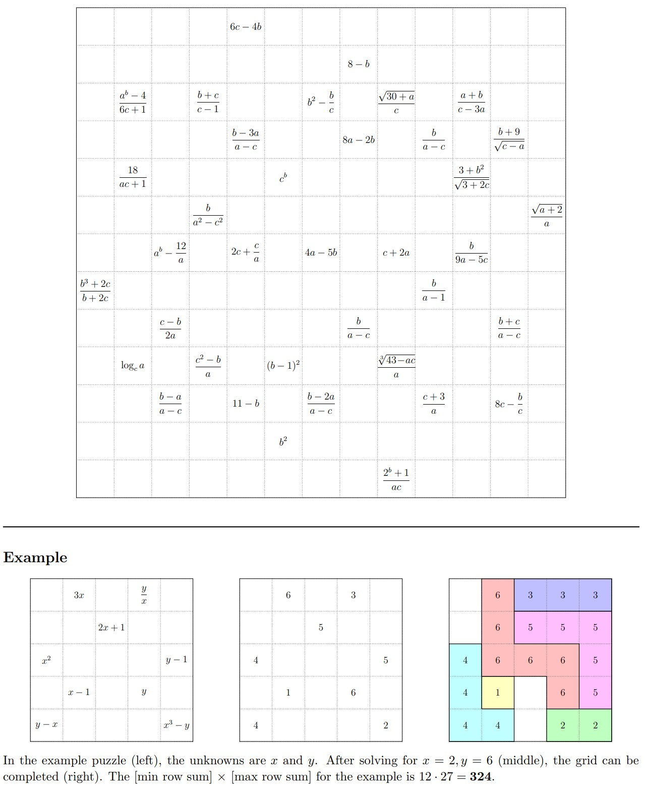

# Subtiles 2 Solver

## Introduction

I built this repository to address the February 2026 Jane Street puzzle [Subtiles 2](https://www.janestreet.com/puzzles/subtiles-2-index/). This is a puzzle I solved before the end of the month by hand earning a spot on the monthly leaderboard. My enjoyment for it as well as the puzzle's suitability for being solved computationally is what led me to build this solver.

## The Puzzle

> Place positive integers in some of the cells above, so that the grid contains one 1, two 2’s, three 3’s, and so on, up to N N’s. (For some N.)
> 
> For any integer K in the grid, the cells labeled K must form an orthogonally connected region (a “K-omino”). Furthermore, for each K > 1 the K-omino must “contain” the shape formed by the (K−1)’s. (Rotations and reflections are allowed.)
> 
> Some of the cells have been labeled, but unlike our previous Subtiles, we have used variables to obscure those values. (As in the example, at the bottom.)
> 
> After completing the grid, compute, in each row, the sum of the labeled cells. The answer to this puzzle is the product of the maximum and minimum row sums.

(The real name for these K-ominos in mathematics is polyomino, coined by Solomon W. Golomb in 1953, which is what I refer to them as throughout the project) 

## Project Description

This project was aimed at being a learning experience rather than actually solving the problem (Jane Street already confirmed that my handwritten solution was correct: [published solution](https://www.janestreet.com/puzzles/subtiles-2-solution/)). Due to this, an integral piece of it was documenting each finding and design decision to act as a journal of discovery as I progressed.

My documented learning process can be found in the findings folder:

1. [Array Generation Latency](findings/1%20-%20Array%20Generation%20Latency.md) - The process of building the first polyomino generator and measuring why it slowed exponentially with n using a runtime evaluator, fixing latency by computing a standard form and using sets.

2. [Memory Scaling Problem](findings/2%20-%20Memory%20Scaling%20Problem.md) - I then found that memory became the new bottleneck at high values of n using a memory evaluator. I used a jsonl cache and hashing to cut down memory requirements from 141GB to 5GB at n=17.

3. [Problem Specific Pruning](findings/3%20-%20Problem%20Specific%20Pruning.md) - Using the actual puzzle board as a restriction to cut down the generation cache to only shapes that would fit on the real board. This ended up cutting down the number of stored shapes from over 17 million to 10,134.

4. [Final solver](findings/4%20-%20Final%20solver.md) - The logic behind the final solver, cutting down the 10,134 pruned shapes to just 94. These were then placed in a tree and searched using in order traversal (Depth First Search).

## Full Repository Guide

- `generators/` - the four generations of polyomino generator, one per stage of the findings (array, set, memory efficient, selective pruning)
- `evaluators/` - scripts used to measure generator performance (runtime and memory usage)
- `analysis/` - scripts used to chart data analysed in [findings](findings)
- `boards/` - puzzle boards as .txt grids (needed for `selective_pruning.py` and `solver.py`)
- `results/` - generator cache results segmented in folders for each generator
- `findings/` - the four journaling findings documents
- `images/` - images used throughout documentation
- `test_cases.py` - hand written test grids used during development
- `solver.py` - the final solver, searches the pruned shapes and prints the solved grid

## Running the Solver

You can directly run `python solver.py` from the repository root to print out the solved grid because `results/early_pruning/subtiles_2/` and `boards/subtiles_2.txt` are already filled in the repository.

All of the caches can be rebuilt from nothing by running `python generators/selective_pruning.py` from the repository root. The flags at the top and bottom of the file control the run: `board_file` sets which board the shapes are pruned against (the board file is a .txt file that needs to be created by hand, check existing boards), `num` sets the highest n to generate up to (16 for the real puzzle). To generate the whole cache iteratively set `use_saved` to `False` but it can be set to `True` to generate individual cache files where the order of the polyomino is the value of `num`.

On my local machine the solver took around 2 minutes to finish and the generator took around 20 minutes for the whole cache.

## Dependencies

The solver and all generators run using the Python standard library. The only external libraries in the repository are `matplotlib` and `numpy`, but they are only used for the charting scripts in `analysis/` used to fill `images/`.
